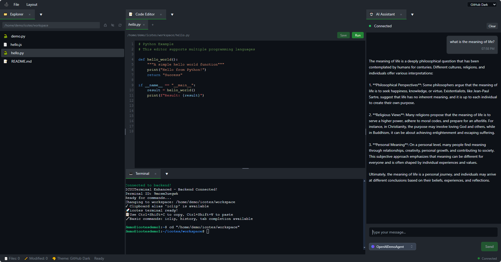

# icotes is an AI powered coding notebook designed to be flexible and customizable.

##### This Repository is currently in pre-alpha and under heavy development, if you do decide to test it, please expect there will be tons of bugs, but feel free to join our discord server and ask questions in the server.

## Features

- 🎨 **Modern UI** - Customizable UI, can be rearanged any way you want.
- 📁 **File Explorer** - Navigate and manage your project files with ease
- ✏️ **Code Editor** - Full-featured editor with syntax highlighting
- 💻 **Integrated Terminal** - Full terminal access via WebSocket
- 🤖 **AI Agents** - Customizable AI agents, support OpenAI sdk, crew, langchain and langgraph, can easily add your own agents via python, expose it in our backend written  in FastAPI and adding it as an option for the chat window.

## Connect with us

[](https://discord.com/invite/f9vT36nV7z)
[](https://www.youtube.com/@icotes)

## Quick Setup

### One-Command Installation

```bash
# Clone the repository
git clone https://github.com/penthoy/icotes.git
cd icotes

# Run automated setup (installs everything and can be run multiple times for updates)
./setup.sh
```

The setup script is **idempotent** - you can run it multiple times safely to update dependencies or reconfigure the environment.

### Manual Installation

**Prerequisites:** Ubuntu/Debian Linux

```bash
# Install dependencies
sudo apt update
sudo apt install -y nodejs npm python3 python3-pip python3-venv

# Install UV package manager (recommended for faster Python dependency management)
curl -LsSf https://astral.sh/uv/install.sh | sh

# Install frontend dependencies
npm install

# Setup backend (UV automatically handles Python dependencies)
cd backend
uv sync
cd ..

# Start development servers
./start-dev.sh
```

## Usage

```bash
# Start both servers (single port mode - everything on port 8000)
./start-dev.sh

# Check server status
./check-servers.sh

# Verify setup
./verify-setup.sh
```

## Access URLs (Single Port Architecture)

- **Application**: http://localhost:8000 (or your configured IP)
- **API Documentation**: http://localhost:8000/docs
- **WebSocket**: ws://localhost:8000/ws

## Configuration

The setup script creates a `.env` file with your local IP configuration. Key settings:

```bash
# Main configuration - everything runs on single port
SITE_URL=192.168.1.100
PORT=8000

# Single port configuration
BACKEND_HOST=192.168.1.100
BACKEND_PORT=8000
BACKEND_URL=http://192.168.1.100:8000

# Frontend served from backend
FRONTEND_HOST=192.168.1.100
FRONTEND_PORT=8000
FRONTEND_URL=http://192.168.1.100:8000

# Vite environment variables
VITE_BACKEND_URL=http://192.168.1.100:8000
VITE_API_URL=http://192.168.1.100:8000/api
VITE_WS_URL=ws://192.168.1.100:8000/ws
```

### API Keys Setup

Update these in your `.env` file for AI agent features:

```bash
OPENAI_API_KEY=your_openai_api_key_here
ANTHROPIC_API_KEY=your_anthropic_api_key_here
GROQ_API_KEY=your_groq_api_key_here
# ... and others
```

## Project Structure

```
icotes/
├── src/              # React frontend components
├── backend/          # FastAPI Python backend
├── workspace/        # Code execution workspace
├── docs/            # Documentation
├── .env             # Environment configuration
├── setup.sh         # Automated setup script
└── start-dev.sh     # Development server startup
```

## Documentation

- [Detailed Setup Guide](docs/SETUP.md)
- [Project Architecture](docs/architecture.md)
- [API Documentation](docs/)
- Invite code on the website: githubprealpha
## Tech Stack

**Frontend:** React 18, TypeScript, Vite, Tailwind CSS, Radix UI  
**Backend:** FastAPI, Python 3.12, Uvicorn, WebSocket  
**AI:** OpenAI, Anthropic, Groq, and more providers  
**Tools:** UV (Python package manager), ESLint, Prettier

## Development Notes

- **Single Port Setup**: Both frontend and backend run on the same port (8000) for simplified development and deployment
- **UV Package Manager**: Uses modern UV for faster Python dependency management
- **Idempotent Setup**: Run `./setup.sh` multiple times safely for updates
- **Environment Variables**: Always use `.env` configuration, never hardcode URLs or ports
- **Idempotent Setup**: Run `./setup.sh` multiple times safely for updates
- **Environment Variables**: Always use `.env` configuration, never hardcode URLs or ports
