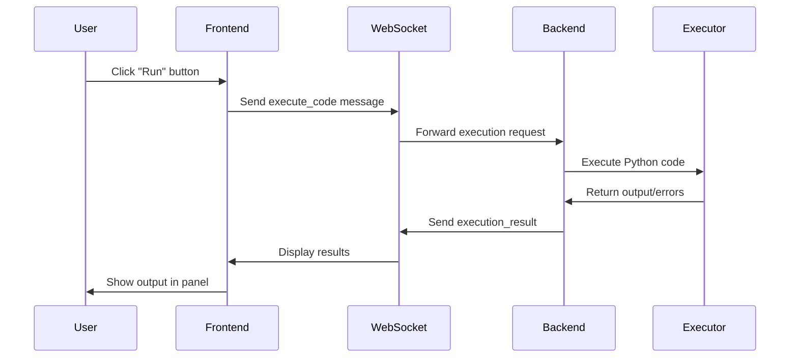
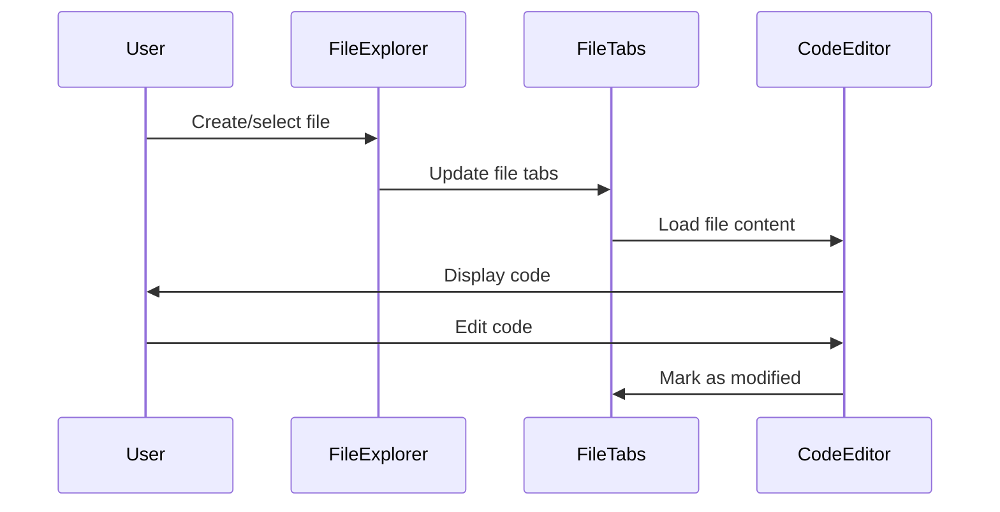

# icotes - System Architecture

## Overview

icotes is a web-based code editor designed as a progressive web application with a modern, scalable architecture. The system follows a client-server model with real-time communication capabilities and modular design principles.

## Current Architecture (v1.0)

### Frontend (Vite + React + TypeScript)

**Technology Stack:**
- **Build Tool**: Vite for fast development and optimized production builds
- **Framework**: React 18 with functional components and hooks
- **Language**: TypeScript for type safety and better developer experience
- **Styling**: Tailwind CSS for utility-first styling
- **UI Components**: ShadCN UI library for consistent, accessible components
- **Code Editor**: CodeMirror 6 for syntax highlighting and editing features

**Architecture Patterns:**
- Component-based architecture with clear separation of concerns
- Hook-based state management for local component state
- Custom utility classes for shared functionality
- Responsive design with mobile-first approach

**Key Components:**
```
src/
├── components/
│   ├── ui/                 # Reusable UI components (ShadCN)
│   ├── CodeEditor.tsx      # Main code editor component
│   ├── Terminal.tsx        # Interactive terminal component
│   ├── FileExplorer.tsx    # File tree and management
│   ├── FileTabs.tsx        # File tab management
│   └── Home.tsx           # Main application container
├── lib/
│   ├── utils.ts           # Utility functions
│   └── codeExecutor.ts    # Backend communication layer
└── types/
    └── supabase.ts        # Type definitions
```

### Backend (FastAPI + Python)

**Technology Stack:**
- **Framework**: FastAPI for high-performance API development
- **Language**: Python 3.9+ for code execution and server logic
- **WebSockets**: Built-in WebSocket support for real-time communication
- **ASGI Server**: Uvicorn for production-ready async server

**Architecture Patterns:**
- RESTful API design with OpenAPI documentation
- WebSocket-based real-time communication
- Async/await patterns for non-blocking operations
- Structured logging and error handling

**API Structure:**
```
backend/
├── main.py              # FastAPI application entry point
├── requirements.txt     # Python dependencies
├── start.sh            # Startup script
└── README.md          # Backend documentation
```

**Endpoints:**
- `GET /` - API information
- `GET /health` - Health check and connection status
- `POST /execute` - Synchronous code execution
- `WS /ws` - WebSocket for real-time communication

### Communication Layer

**WebSocket Protocol:**
```typescript
interface WebSocketMessage {
  type: 'execute_code' | 'ping' | 'pong' | 'execution_result' | 'echo';
  code?: string;
  language?: string;
  output?: string[];
  errors?: string[];
  execution_time?: number;
  message?: string;
}
```

**Fallback Strategy:**
1. Primary: WebSocket for real-time communication
2. Fallback: REST API for reliability
3. Auto-reconnection with exponential backoff

## Data Flow

### Code Execution Flow



### File Management Flow



## Security Considerations

### Current Implementation
- CORS policy configured for cross-origin requests
- Input sanitization for code execution
- Error handling to prevent information leakage

### Security Limitations (To Address)
- Code execution runs in main process (not sandboxed)
- No authentication or authorization
- No rate limiting on API endpoints
- No input validation beyond basic type checking

## Performance Considerations

### Frontend Optimizations
- Vite for fast development and optimized builds
- CodeMirror 6 for efficient large file handling
- Lazy loading for better initial load times
- Component memoization where appropriate

### Backend Optimizations
- Async FastAPI for concurrent request handling
- WebSocket connection pooling
- Efficient Python code execution with output capture

## Scalability Design

### Horizontal Scaling
- Stateless backend design for easy horizontal scaling
- WebSocket connection management with load balancing support
- Frontend served from CDN for global distribution

### Vertical Scaling
- Async architecture for better resource utilization
- Memory-efficient code execution
- Connection pooling for database operations (future)

## Future Architecture (v2.0+)

### Planned Enhancements

**Rust Backend Migration:**
- Replace Python backend with Rust for:
  - Better performance and memory safety
  - Lower resource consumption
  - Enhanced security features
  - Native WebAssembly support

**Microservices Architecture:**
```
┌─────────────────┐    ┌─────────────────┐    ┌─────────────────┐
│   Frontend      │    │  API Gateway    │    │  Code Executor  │
│   (Vite/React)  │◄──►│   (Rust)        │◄──►│    (Rust)       │
└─────────────────┘    └─────────────────┘    └─────────────────┘
                                │
                                ▼
                       ┌─────────────────┐
                       │  File Manager   │
                       │    (Rust)       │
                       └─────────────────┘
                                │
                                ▼
                       ┌─────────────────┐
                       │   Database      │
                       │ (PostgreSQL)    │
                       └─────────────────┘
```

**Enhanced Security:**
- Sandboxed code execution using containers
- JWT-based authentication
- Role-based access control
- API rate limiting and throttling

**Advanced Features:**
- Multi-language support (JavaScript, Python, Rust, Go)
- Real-time collaboration using WebRTC
- Plugin system for extensibility
- Advanced debugging capabilities

## Deployment Architecture

### Current Deployment
- Frontend: Static hosting (Vercel, Netlify, or CDN)
- Backend: Container deployment (Docker)
- Database: Not implemented yet

### Production Deployment (Planned)
```
┌─────────────────┐
│   CDN/WAF       │
│  (Cloudflare)   │
└─────────┬───────┘
          │
┌─────────▼───────┐
│ Load Balancer   │
│  (Nginx/HAProxy)│
└─────────┬───────┘
          │
    ┌─────▼─────┐
    │  Frontend │
    │ (Static)  │
    └───────────┘
          │
┌─────────▼───────┐
│  API Gateway    │
│  (Kong/Envoy)   │
└─────────┬───────┘
          │
    ┌─────▼─────┐    ┌─────────────┐
    │  Backend  │◄──►│  Database   │
    │(Containers)│    │(PostgreSQL) │
    └───────────┘    └─────────────┘
```

## Development Workflow

### Frontend Development
1. Local development with Vite dev server
2. Hot module replacement for fast iteration
3. TypeScript checking and ESLint
4. Component testing with React Testing Library

### Backend Development
1. FastAPI with auto-reload for development
2. Python virtual environment for isolation
3. API documentation auto-generation
4. Unit testing with pytest

### Integration Testing
1. End-to-end testing with Playwright
2. WebSocket connection testing
3. Code execution validation
4. Performance benchmarking

## Monitoring and Observability

### Current Status
- Basic logging in backend
- Console logging in frontend
- Health check endpoint

### Planned Monitoring
- Structured logging with correlation IDs
- Metrics collection (Prometheus)
- Distributed tracing (Jaeger)
- Real-time monitoring dashboards
- Error tracking (Sentry)

## Technology Decisions

### Why Vite?
- Faster development builds compared to Webpack
- Native ES modules support
- Better tree-shaking and optimization
- Excellent TypeScript support

### Why FastAPI?
- High performance async framework
- Automatic API documentation
- Type hints and validation
- WebSocket support out of the box

### Why React?
- Large ecosystem and community
- Excellent TypeScript integration
- Component reusability
- Strong developer tooling

### Why TypeScript?
- Type safety for reduced runtime errors
- Better developer experience with IntelliSense
- Easier refactoring and maintenance
- Self-documenting code

## Conclusion

The current architecture provides a solid foundation for a modern code editor with real-time capabilities. The modular design allows for incremental improvements and technology migrations. The planned Rust backend will provide better performance and security, while the microservices approach will enable better scalability and maintainability.

The architecture balances current needs with future growth, ensuring the system can evolve with changing requirements and technology landscapes.
